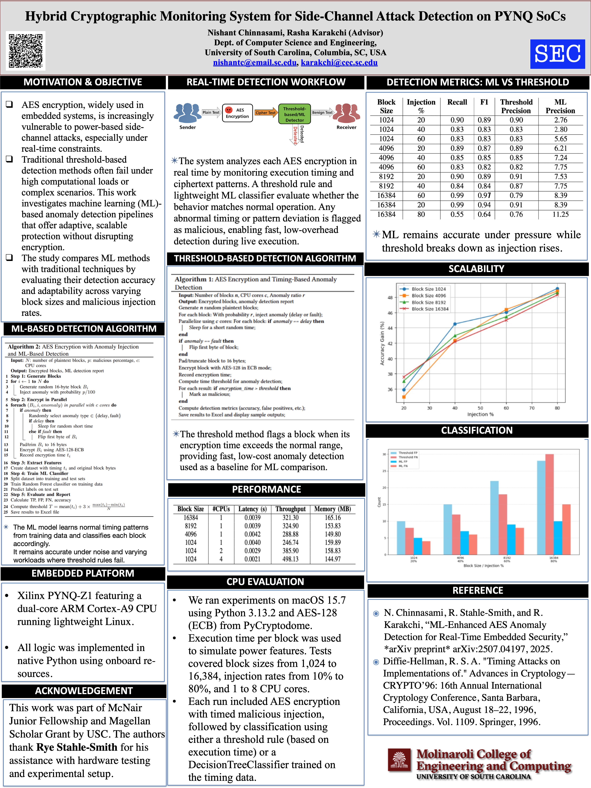
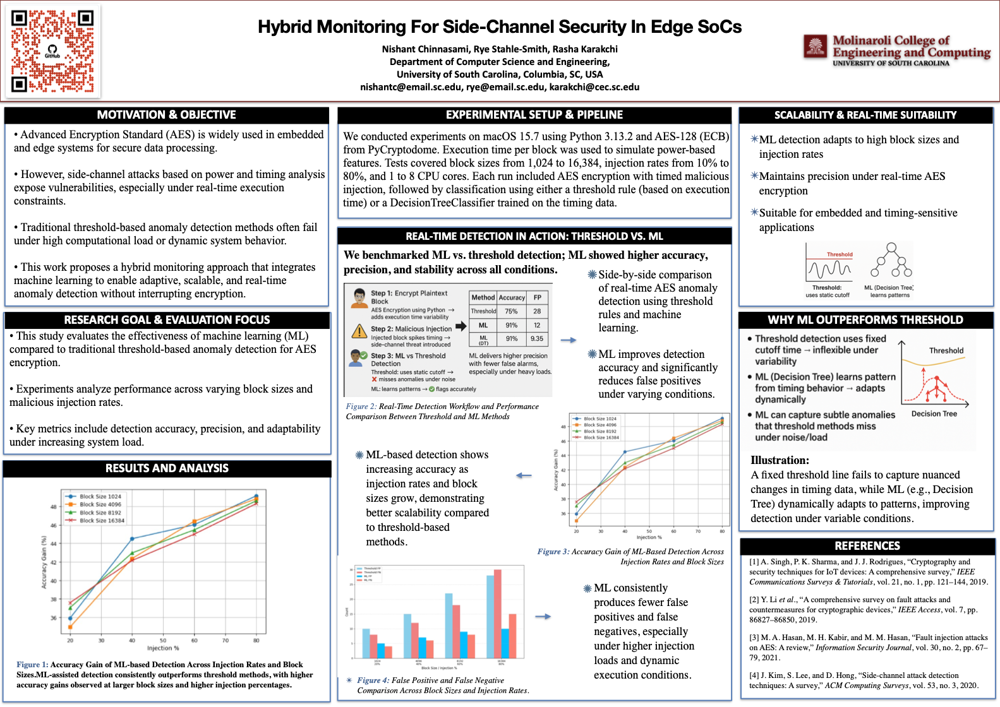
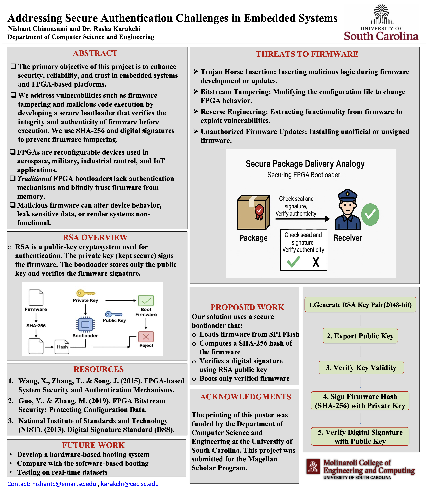
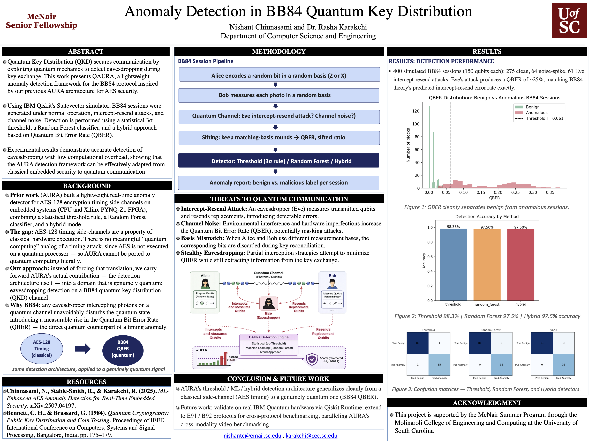
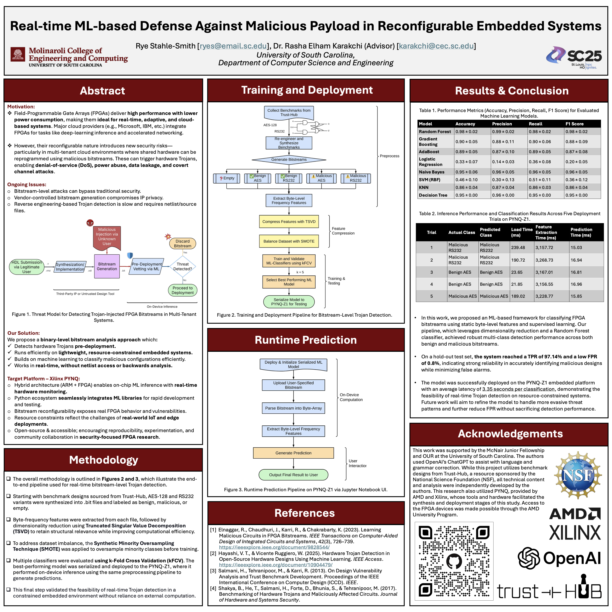
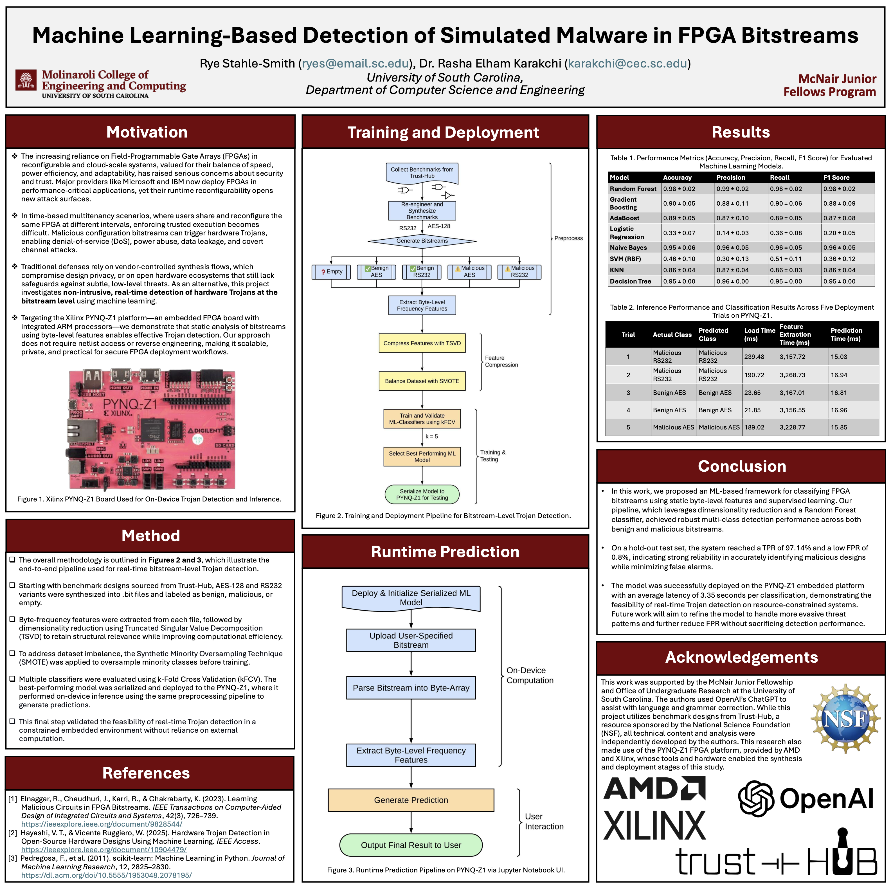

# Karakchi Research

Student-led research in embedded security, hardware assurance, and intelligent systems at the University of South Carolina, advised by Dr. Rasha Karakchi.

  <a href="https://sc.edu/study/colleges_schools/engineering_and_computing/faculty-staff/karakchi_rasha.php">Faculty profile</a> ·
  <a href="mailto:karakchi@cec.sc.edu">Contact</a>

## Research focus

| Area | What we explore |
| --- | --- |
| **Embedded & hardware security** | FPGA, PYNQ SoC, secure boot, bitstream integrity, and hardware-Trojan detection. |
| **AI for cyber defense** | Machine-learning methods for real-time anomaly and malware detection. |
| **Cryptography & quantum security** | Side-channel resilience, AES monitoring, and quantum key-distribution anomaly detection. |

## Featured projects

- [AURA](https://github.com/Karakchi-Research/AURA) — Real-time AES-128 anomaly detection using threshold and machine-learning frameworks.
- [PYNQ_BLADEI](https://github.com/Karakchi-Research/PYNQ_BLADEI) — Embedded FPGA bitstream malware detection and classification.
- [BASE](https://github.com/Karakchi-Research/BASE) — FPGA streaming preprocessing for byte-level security analytics.
- [AutoSlim](https://github.com/Karakchi-Research/AutoSlim) — AI-assisted graph pruning for downstream analysis and hardware simulation.

## Research posters

Select a poster title to preview it directly on this page. Select the title again to collapse it, or select the poster image to open the full PDF in GitHub.

<strong>Hybrid Cryptographic Monitoring System for Side-Channel Attack Detection on PYNQ SoCs</strong>

**Nishant Chinnasami** · SEC

Real-time monitoring of AES encryption on PYNQ SoCs, combining threshold-based and machine-learning detection for side-channel attacks.

[Open poster PDF](posters/nishant_acm_2025.pdf)

<strong>Hybrid Monitoring for Side-Channel Security in Edge SoCs</strong>

**Nishant Chinnasami, Rye Stahle-Smith, and Dr. Rasha Karakchi** · Discover USC

Adaptive monitoring that uses machine learning to identify timing-based anomalies in edge-system encryption workloads.

[Open poster PDF](posters/nishant_discoverusc_hybrid-monitoring_2025.pdf)

<strong>Addressing Secure Authentication Challenges in Embedded Systems</strong>

**Nishant Chinnasami and Dr. Rasha Karakchi** · Discover USC

A secure-boot approach for FPGA-based embedded systems using SHA-256 integrity checks and RSA signatures.

[Open poster PDF](posters/nishant_discoverusc_secure-authentication_2025.pdf)

<strong>Anomaly Detection in BB84 Quantum Key Distribution</strong>

**Nishant Chinnasami and Dr. Rasha Karakchi** · Summer Symposium

An anomaly-detection framework for identifying eavesdropping and channel noise in BB84 quantum key-distribution sessions.

[Open poster PDF](posters/nishant_summer-symposium_bb84-anomaly-detection_2025.pdf)

<strong>Real-time ML-based Defense Against Malicious Payload in Reconfigurable Embedded Systems</strong>

**Rye Stahle-Smith and Dr. Rasha Karakchi** · SC25

Machine-learning-based pre-deployment detection of malicious FPGA bitstreams in reconfigurable embedded systems.

[Open poster PDF](posters/rye_sc25_real-time-ml-defense_2025.pdf)

<strong>ML-Based Detection of Simulated Malware in FPGA Bitstreams</strong>

**Rye Stahle-Smith and Dr. Rasha Karakchi** · Summer Symposium

An on-device pipeline for classifying malicious FPGA bitstreams using byte-level features and supervised machine learning.

[Open poster PDF](posters/rye_summer-symposium_fpga-malware-detection_2025.pdf)

## Collaborate with us

We welcome student researchers interested in hardware and embedded security, applied machine learning, cryptography, and dependable systems. Explore a project repository to learn more, or contact Dr. Karakchi about joining the group.

---

*This organization hosts academic and research materials. Individual repositories include their own licensing information where applicable.*
