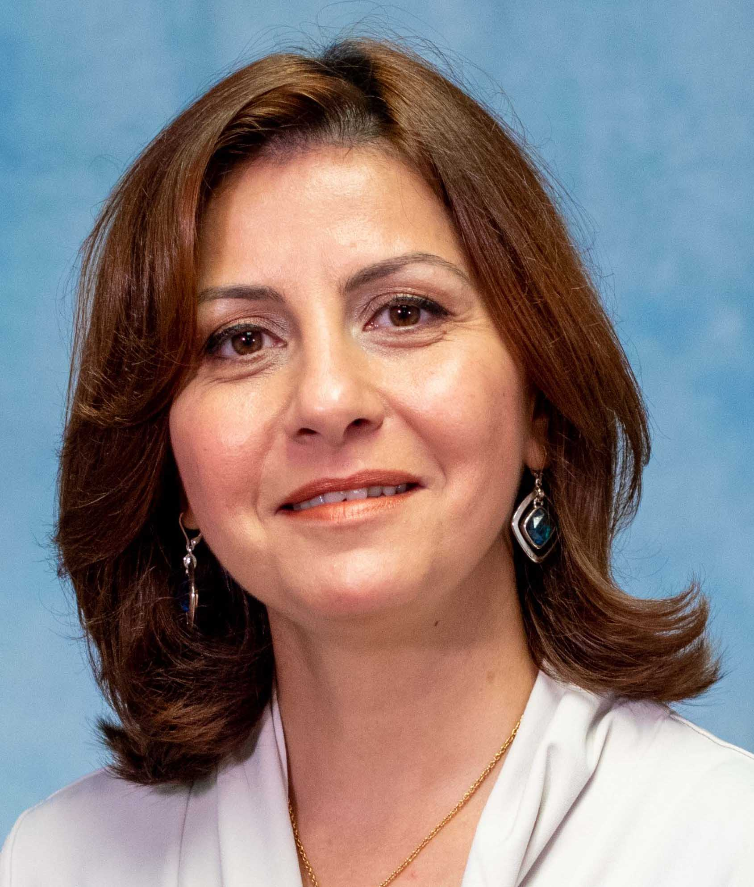

<h1>Research people</h1>

## Research contributors

| Photo | Person | Focus | Research represented | LinkedIn |
| --- | --- | --- | --- | --- |
|  | **Tiffany Yu** | Computer science · intelligent hardware | Automata optimization, LabVIEW FPGA, MLP acceleration, computational-hardware security | [Profile](https://www.linkedin.com/in/tyu05) |
|  | **Rye Stahle-Smith** | Embedded security · ML systems | FPGA malware detection, real-time ML defense, automata simplification, multimodal monitoring | [Profile](https://www.linkedin.com/in/rye-stahle-smith) |
|  | **Nishant Chinnasami** | Cryptography · cyber-physical monitoring | Hybrid cryptographic monitoring, side-channel security, QKD anomaly detection, additive-manufacturing security | [Profile](https://www.linkedin.com/in/nishantchinnasami) |
|  | **Carter Antley** | Hardware security | Trustworthy FPGA Trojan localization from configuration bitstreams | [Profile](https://www.linkedin.com/in/carter-antley) |
|  | **Ryan Karbowniczak** | Intelligent systems · accelerators | Scored NFA processing and self-explanatory transformer research | [Profile](https://www.linkedin.com/in/ryan-karbowniczak-2b6158224) |
|  | **Noah Robertson** | Machine learning | Neural-network digit recognition | [Profile](https://www.linkedin.com/in/noah-robertson-330331211) |
|  | **Vito Spatafora** | Edge AI systems | EdgeBench preprocessing and streaming ingestion | [Profile](https://www.linkedin.com/in/vito-spatafora) |
|  | **Zaki Bushiri** | Secure intelligent systems | Multimodal monitoring for additive manufacturing | [Profile](https://www.linkedin.com/in/zakibushiri) |
|  | **Jacob Frierson** | Neural Network | Reconfigurable Computing | [Profile](https://www.linkedin.com/in/jacob-frierson-194139399/) |

## Faculty and research leadership

| Photo | Person | Role | Research represented | LinkedIn |
| --- | --- | --- | --- | --- |
|  | **Rasha Elham Karakchi** | Faculty lead · Karakchi Research | Hardware security, intelligent systems, FPGA acceleration, cryptography | [USC faculty profile](https://sc.edu/study/colleges_schools/engineering_and_computing/faculty-staff/karakchi_rasha.php) |

## Browse their work

Return to the [research library](README.md) to browse every poster and paper by year. Each entry opens the complete source PDF.
